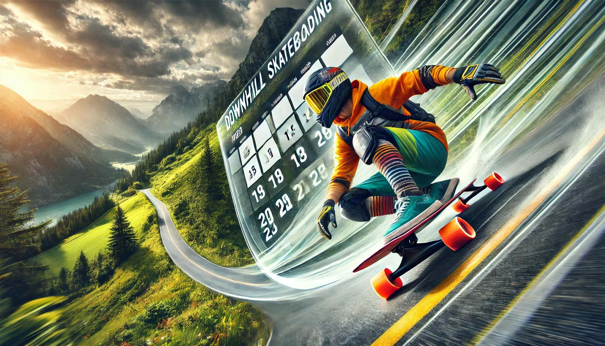

# Downhill Skateboarding Events

**A Django-based web application for managing downhill skateboarding events.**

## Introduction

This Django project provides a platform for:

* **Event Management:** Creating, editing, and deleting events.
* **User Profiles:** Allowing users to create profiles, show interest in events,
  and leave comments and reviews
* **Event Calendar:** Displaying events in a calendar view, with filtering and search capabilities.
* **Notifications:** Sending email notifications for event updates and reminders.

## Features

* **Event Management:**
    * Create, edit, and delete events.
    * Set event dates, times, locations, and descriptions.
    * Upload event images.
* **User Profiles:**
    * User registration and authentication.
    * Profile customization (avatar, bio, preferences).
    * Event registration and attendance tracking.
    * Commenting and rating events.
* **Event Calendar:**
    * Monthly and weekly calendar views.
    * Event filtering and search.
    * Map integration for event locations.
* **Notifications:**
    * Email notifications for event updates, reminders, and comments.
    * Push notifications (optional).

## Technologies Used

* **Python:** The core programming language.
* **Django:** The web framework.
* **PostgreSQL:** The database system.
* **HTML, CSS, JavaScript:** For frontend development.

## Additional Tools

* **Cloudinary:** For managing and hosting images.
* **Tailwind CSS:** For utility-first CSS framework.
* **DaisyUI:** For UI components built on Tailwind CSS.
